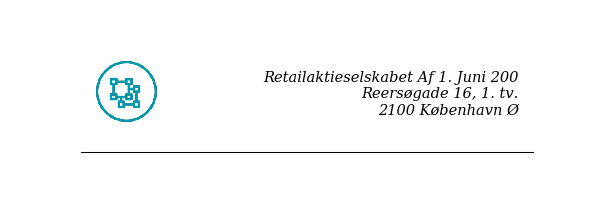
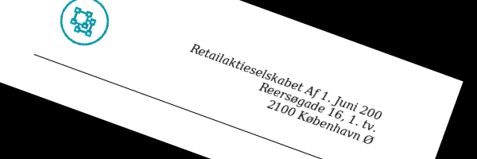
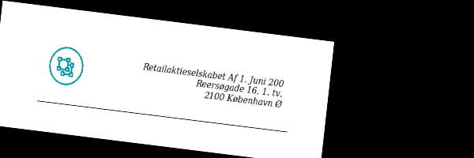
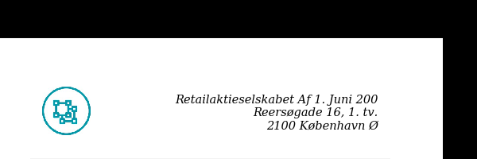
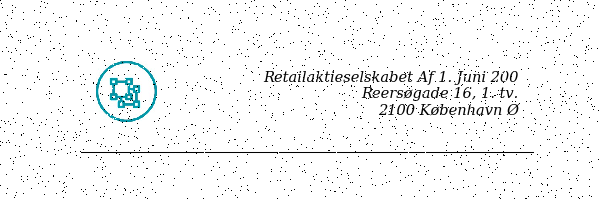
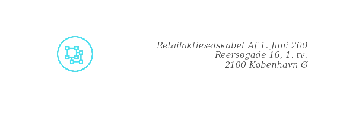
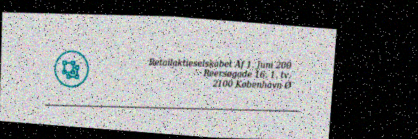

# Easy Image Augmentation

`image_augmentation` is a simple library aimed at making it easy to employ custom image augmentation of images used as inputs in deep learning models.

The module has a single Augmentor class, which serves as a constructor of an object to which images afterwards can be passed in batches for augmentation.

Thus it is easy to add additional augmentation functions by

1. Adding a method for the augmentation implementation and
2. Adding the given augmentation to the augmentation method.

The aim of `image_augmentation` is to be fast. As such only [numpy](http://www.numpy.org) or [OpenCV](https://opencv.org) based transformations are employed, and should be kept as such, (i.e. no [PIL](http://pillow.readthedocs.io/en/latest/) please :))

## Usage

Make the `Augmentor` object vith given ranges for random image augmentation. Next serve the `augment()` medthod with images in batches. Maybe there is a todo here, refactoring the code such that the `augment()` method is only served single images for easier integration with generators.

## Example

Below follow examples of current implemented augmentation types.

### Original image:

```python
Image.fromarray(addr.headers_hr[0])
```



### Rotation

```python
augmentor = Augmentor(rotation_range = 20)

Image.fromarray(augmentor.augment(addr.headers_hr)[0])
```



### Shear

```python
augmentor = Augmentor(shear_range = 5)

Image.fromarray(augmentor.augment(addr.headers_hr)[0])
```



### Shift

```python
augmentor = Augmentor(shift_range = 20)

Image.fromarray(augmentor.augment(addr.headers_hr)[0])
```



### Gaussian Blur

```python
augmentor = Augmentor(gaussian_blur_sd = 3)

Image.fromarray(augmentor.augment(addr.headers_hr)[0])
```


### Gaussian Noise

```python
augmentor = Augmentor(gauss_noise_sd = 30)

Image.fromarray(augmentor.augment(addr.headers_hr)[0])
```


### Salt and Pepper Noise

```python
augmentor = Augmentor(salt_and_pepper_noise_intensity = 0.01)

Image.fromarray(augmentor.augment(addr.headers_hr)[0])
```



### RGB color shift

```python
augmentor = Augmentor(rgb_color_shift = 50)

Image.fromarray(augmentor.augment(addr.headers_hr)[0])
```



### Everything

```python
augmentor = Augmentor(rotation_range = 10,
                      shear_range = 2.5,
                      shift_range = 10,
                      gaussian_blur_sd = 3,
                      gauss_noise_sd = 30,
                      salt_and_pepper_noise_intensity = 0.01,
                      rgb_color_shift = 50)

Image.fromarray(augmentor.augment(addr.headers_hr)[0])
```



## Contributors:

Andreas (anlaursen@deloitte.dk)
Jacob (jaxelsen@deloitte.dk)